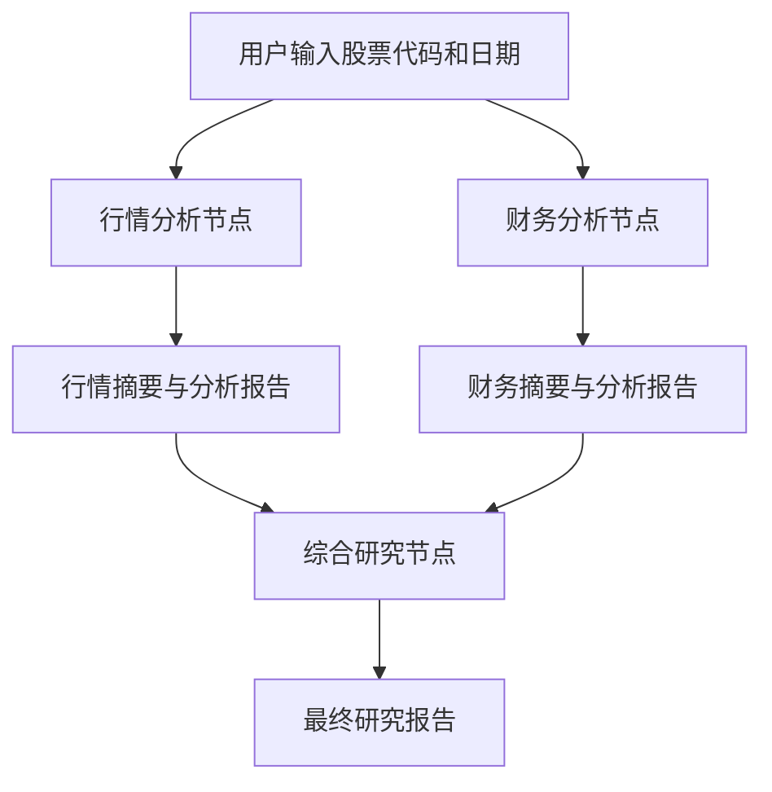

# AStock Research Agent
[](https://github.com/Dong-pixel/AStock-Research-Agent/actions/workflows/ci.yml)
基于 LangGraph、DeepSeek 和 AKShare 构建的 A 股多智能体研究系统。

系统并行执行行情分析与财务分析，最后由综合研究智能体生成结构化中文报告。财务模块会根据实际披露日期过滤数据，降低历史研究中的前视偏差。

## 核心功能

- 获取并标准化 A 股历史行情
- 计算区间收益、价格区间和成交活跃度
- 获取上市公司财务指标
- 计算同报告期营收、净利润、ROE 和毛利率变化
- 根据财报披露日期过滤历史不可见数据
- 使用 LangGraph 编排行情、财务和综合研究智能体
- 通过 CLI 一条命令生成研究报告

## 工作流



## 技术栈

- Python 3.11
- LangGraph
- LangChain
- DeepSeek
- AKShare
- Pydantic
- Pandas
- Typer
- Rich
- Pytest
- Ruff

## 快速开始

创建并激活 Conda 环境：

```bash
conda create -n astock-agent python=3.11 -y
conda activate astock-agent
```

安装项目：

```bash
python -m pip install -e ".[dev]"
```

复制环境变量模板：

```bash
cp .env.example .env
```

在 `.env` 中填写自己的 DeepSeek API Key。不要提交 `.env`。

运行：

```bash
astock-agent 600519 20260901 20260918
```

参数依次表示：

```text
股票代码、行情开始日期、研究截止日期
```

## 数据时点说明

财务数据会根据 `notice_date` 过滤，只使用研究截止日前已经披露的报告，从而降低历史研究中的前视偏差。

当前数据来自 AKShare/东方财富的现有数据库，可能包含后续修订值，因此暂不保证完全恢复历史数据版本。

## 免责声明

本项目仅用于技术学习和研究演示，不构成投资建议，也不承诺任何收益。